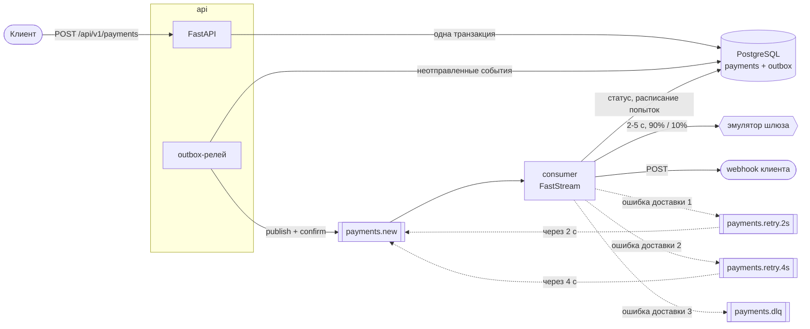
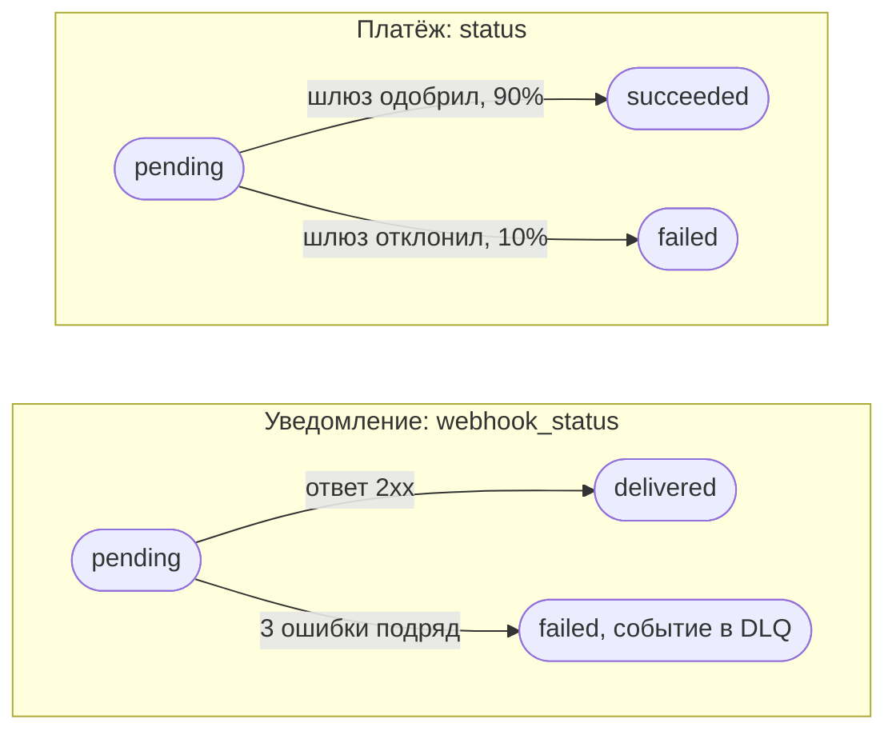
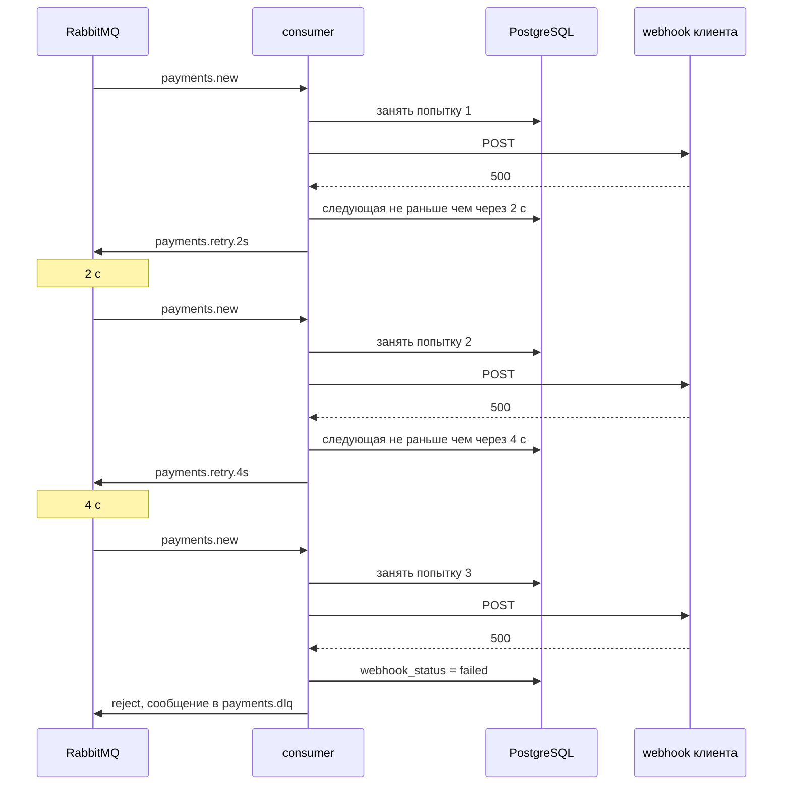

# Payment processing service

[](https://github.com/Refusned/payment-processing-service/actions/workflows/ci.yml)


Микросервис принимает запросы на оплату, асинхронно проводит их через эмулятор платёжного шлюза и сообщает результат на webhook клиента.

Стек: FastAPI, Pydantic v2, SQLAlchemy 2.0 (async), PostgreSQL 16, RabbitMQ 4.3 через FastStream, Alembic, Docker Compose.

## Запуск

Нужен Docker с Compose v2.24 или новее.

```bash
docker compose up -d --build --wait
./scripts/demo.sh
```

Поднимаются `postgres`, `rabbitmq`, `migrate` (применяет миграции и завершается), `api`, `consumer` и `webhook-receiver`. Последний нужен только для проверки: всё, что ему пришло, видно на `/received`. `demo.sh` проходит основной сценарий (создание, повтор запроса, обработка, webhook) и завершается с ошибкой, если что-то пошло не так.

`.env` не обязателен, значения по умолчанию заданы в compose. Поменять порты или ключ можно в `.env` (пример в `.env.example`), его читают и compose, и `demo.sh`. Порты слушают только `127.0.0.1`, PostgreSQL и AMQP опубликованы на нестандартных 55432 и 55672, чтобы не столкнуться с локально установленными. Если какой-то порт занят, поменяйте его в `.env`.

| Что | Адрес |
|---|---|
| API | http://127.0.0.1:8000 |
| RabbitMQ UI | http://127.0.0.1:15672, guest / guest |
| Получатель webhook | http://127.0.0.1:9000/received |

API-ключ по умолчанию `dev-api-key`. Swagger выключен, потому что ключ требуется на всех эндпоинтах, а страницу документации браузер с заголовком не откроет. Включается строкой `DOCS_ENABLED=true` в `.env`, после этого он доступен на `/docs` без ключа.

## Как устроено



У платежа два независимых статуса: результат оплаты и судьба уведомления о нём.



Как выглядят повторы, если получатель не отвечает:



**Outbox.** Платёж и событие `payment.created` пишутся в одной транзакции, поэтому событие не теряется, если процесс упадёт сразу после коммита. Релей выбирает неопубликованные строки через `SELECT ... FOR UPDATE SKIP LOCKED`, публикует их с подтверждением брокера (publisher confirms, `mandatory`) и только после подтверждения ставит `published_at`. Если сообщение не попало ни в одну очередь (например, пропал binding), брокер его возвращает, релей получает исключение и откладывает событие с растущей паузой до 60 с. Ошибка и число попыток видны в самой строке outbox. К брокеру релей подключается сам и с повторами, поэтому api стартует и принимает платежи, даже если RabbitMQ недоступен.

**Идемпотентность на входе.** `idempotency_key` уникален в таблице `payments`. Вставка идёт через `INSERT ... ON CONFLICT DO NOTHING`, так что из одновременных запросов с одним ключом платёж создаёт ровно один, остальные получают тот же ответ. В строке хранится sha256 тела запроса: тот же ключ с другим телом отклоняется. Сумма перед хэшем нормализуется, `"100"` и `"100.00"` это один запрос.

**Обработка дублей.** Outbox публикует at-least-once, поэтому одно событие может прийти дважды, в том числе одновременно. Результат эмулятора записывается условным `UPDATE ... WHERE status = 'pending'`: статус меняется ровно один раз, проигравшая копия свой результат отбрасывает. Расписание доставки webhook хранится в строке платежа: счётчик попыток и `webhook_next_attempt_at`, раньше которого следующая попытка не начнётся. Попытка резервируется коротким коммитом до HTTP-запроса (счётчик плюс один, срок попытки 15 с), а после ответа записывается результат и время следующей попытки. Копия события, пришедшая раньше этого времени, ничего не отправляет и возвращается в retry-очередь подождать. Блокировка строки держится только на время резервирования, вызов шлюза и запрос к получателю идут вне транзакций.

**Повторы.** Отказ шлюза (10%) считается результатом платежа, а не ошибкой: статус `failed`, клиент получает webhook `payment.failed`. Повторяется доставка webhook при ошибке сети, таймауте и любом ответе кроме 2xx: сразу, через 2 с и через 4 с. Задержка сделана временем жизни сообщения в отдельной очереди без потребителей: когда TTL истекает, брокер сам возвращает сообщение в `payments.new`. Очередь на каждую задержку своя, иначе сообщение с длинной задержкой в голове общей очереди задерживало бы остальные. Если не удалось опубликовать сообщение в retry-очередь, оно возвращается в рабочую очередь, а время следующей попытки всё равно берётся из базы. Ошибки инфраструктуры до решения о доставке (например, недоступна база) попыток не тратят: событие ждёт в retry-очереди по 4 с, до 30 раз, то есть около двух минут, и только потом уходит в DLQ. Пока база недоступна, API отвечает 503.

**DLQ.** После третьей неудачной попытки сообщение отклоняется и через `payments.dlx` попадает в `payments.dlq`. Туда же уходят сообщения, которые не разбираются, и события по несуществующему платежу. Все очереди quorum со стратегией dead-lettering `at-least-once`: у классических очередей пересылка в DLX идёт в режиме at-most-once, и сообщение могло бы потеряться по пути в DLQ или из retry-очереди обратно.

**Аутентификация.** Статический ключ в `X-API-Key`, сравнение через `secrets.compare_digest`.

### Гарантии и их границы

- Принятый платёж (ответ 202) не теряется: событие лежит в outbox, пока брокер не подтвердит приём.
- Итоговый статус платежа записывается один раз.
- На доставку webhook три попытки с паузами 2 и 4 с, их делят все копии события. После третьей неудачи `webhook_status` становится `failed`, событие уходит в DLQ и автоматически больше не повторяется. Попытка засчитывается в момент начала, поэтому упавший посреди запроса процесс её тоже расходует.
- Дубль webhook возможен: получатель принял запрос, а мы об этом не узнали (оборвался ответ, упал процесс или база не дала записать результат). Поэтому получателю стоит дедуплицировать по `X-Event-Id`.
- Если события копировались, в DLQ может оказаться несколько сообщений с одним `x-event-id`.
- Шлюз при повторной доставке события может быть вызван второй раз, сохранится результат первого. Эмулятор внешних эффектов не имеет, настоящему шлюзу передавался бы id платежа как ключ идемпотентности.
- Если база недоступна дольше двух минут, событие уходит в DLQ, а платёж остаётся в `pending` до ручного разбора.
- У quorum-очередей RabbitMQ по умолчанию `delivery-limit` 20: если consumer 20 раз подряд упадёт на одном сообщении, брокер сам отправит его в DLQ.

## API

Все эндпоинты требуют заголовок `X-API-Key`.

### Создание платежа

```bash
curl -i -X POST http://127.0.0.1:8000/api/v1/payments \
  -H "X-API-Key: dev-api-key" \
  -H "Idempotency-Key: order-1001" \
  -H "Content-Type: application/json" \
  -d '{
        "amount": "1500.00",
        "currency": "RUB",
        "description": "Order 1001",
        "metadata": {"order_id": 1001},
        "webhook_url": "http://webhook-receiver:9000/ok"
      }'
```

```
HTTP/1.1 202 Accepted

{"payment_id": "b230e633-1f02-4cb5-bfb3-a42ad0e12d78", "status": "pending", "created_at": "2026-10-08T08:37:54.613222Z"}
```

`amount` лучше передавать строкой, до двух знаков после запятой. `description` и `metadata` необязательны. `webhook_url` указан адресом внутри docker-сети, потому что запрос к нему делает consumer.

У получателя есть и другие адреса: `/fail` всегда отвечает 500 (так видно три попытки и уход в DLQ), `/flaky/2` отвечает 500 на первые два запроса и 200 на третий, `/slow` не отвечает дольше, чем мы готовы ждать. Для нового сценария нужен новый `Idempotency-Key`: тот же ключ с другим телом вернёт 422.

### Получение платежа

```bash
PAYMENT_ID=b230e633-1f02-4cb5-bfb3-a42ad0e12d78   # из ответа на создание
curl http://127.0.0.1:8000/api/v1/payments/$PAYMENT_ID -H "X-API-Key: dev-api-key"
```

```json
{
  "id": "b230e633-1f02-4cb5-bfb3-a42ad0e12d78",
  "amount": "1500.00",
  "currency": "RUB",
  "description": "Order 1001",
  "metadata": {"order_id": 1001},
  "status": "succeeded",
  "failure_reason": null,
  "idempotency_key": "order-1001",
  "webhook_url": "http://webhook-receiver:9000/ok",
  "webhook_status": "delivered",
  "webhook_attempts": 1,
  "webhook_last_error": null,
  "webhook_delivered_at": "2026-10-08T08:37:59.021280Z",
  "created_at": "2026-10-08T08:37:54.613222Z",
  "processed_at": "2026-10-08T08:37:58.984511Z",
  "updated_at": "2026-10-08T08:37:59.021280Z"
}
```

`status` показывает результат платежа, `webhook_status` показывает, дошло ли уведомление (`pending`, `delivered` или `failed`, если три попытки не удались).

### Webhook

```
POST <webhook_url>
X-Event-Id: 339964e7-7900-52c9-992b-6dd0714a6c34
X-Event-Type: payment.succeeded

{
  "event_id": "339964e7-7900-52c9-992b-6dd0714a6c34",
  "event_type": "payment.succeeded",
  "payment_id": "b230e633-1f02-4cb5-bfb3-a42ad0e12d78",
  "status": "succeeded",
  "amount": "1500.00",
  "currency": "RUB",
  "description": "Order 1001",
  "metadata": {"order_id": 1001},
  "failure_reason": null,
  "created_at": "2026-10-08T08:37:54.613222Z",
  "processed_at": "2026-10-08T08:37:58.984511Z"
}
```

Успехом считается любой ответ 2xx. Редиректы не выполняются. `X-Event-Id` одинаковый на всех повторах одного уведомления.

### Коды ответов

| Ситуация | Ответ |
|---|---|
| нет или неверный `X-API-Key` | 401 |
| нет `Idempotency-Key` (или длиннее 255 символов) | 400 |
| невалидное тело | 422 |
| тот же `Idempotency-Key` с другим телом | 422 |
| повтор того же запроса | 202, исходный ответ и заголовок `Idempotent-Replayed: true` |
| платёж не найден | 404 |
| база недоступна | 503 и `Retry-After` |

Коды для идемпотентности взяты из драфта IETF [Idempotency-Key HTTP Header](https://datatracker.ietf.org/doc/draft-ietf-httpapi-idempotency-key-header/): 400 без ключа, 422 при повторе ключа с другим телом. Повтор возвращает исходный ответ (`status: pending`), актуальный статус отдаёт GET.

## Требования задания

| Требование | Где |
|---|---|
| Модели и миграции: `payments` и `outbox` | `app/models.py`, `alembic/versions/` |
| `POST /api/v1/payments` с обязательным `Idempotency-Key`, ответ 202 | `app/api.py`, `app/payments.py` |
| `GET /api/v1/payments/{payment_id}` | `app/api.py` |
| Событие в `payments.new` через outbox | `app/payments.py` (запись), `app/outbox.py` (публикация) |
| Один consumer: эмуляция 2-5 c и 90/10, статус, webhook, повторы | `app/consumer.py`, `app/processing.py`, `app/gateway.py`, `app/webhooks.py` |
| 3 попытки с экспоненциальной задержкой | `app/messaging.py` (очереди 2 c и 4 c), `app/processing.py` (расписание) |
| Dead Letter Queue | `app/messaging.py` (`payments.dlx` и `payments.dlq`) |
| `X-API-Key` на всех эндпоинтах | `app/api.py` |
| Docker Compose: postgres, rabbitmq, api, consumer | `docker-compose.yml`, `Dockerfile` |
| README с запуском и примерами | этот файл, `scripts/demo.sh` |

## Структура

```
app/
  api.py          эндпоинты и проверка ключа
  payments.py     создание платежа: идемпотентность и запись в outbox
  outbox.py       релей outbox -> RabbitMQ
  messaging.py    очереди, обменники, повторы, публикация с подтверждением
  consumer.py     обработчик сообщений (FastStream)
  processing.py   результат платежа и доставка webhook
  gateway.py      эмулятор платёжного шлюза
  webhooks.py     тело уведомления и отправка
  models.py, schemas.py, config.py, db.py, main.py
alembic/          миграции
tools/            получатель webhook для проверки
tests/unit/       без Docker
tests/integration/  против поднятого стека
scripts/demo.sh   основной сценарий одной командой
```

## Конфигурация

Настройки приложения перечислены в `app/config.py`, задаются переменными окружения и попадают в контейнеры из `.env`. Основные:

| Переменная | По умолчанию | Назначение |
|---|---|---|
| `API_KEY` | `dev-api-key` | ключ для `X-API-Key` |
| `DOCS_ENABLED` | `false` | Swagger и OpenAPI |
| `GATEWAY_MIN_DELAY`, `GATEWAY_MAX_DELAY` | `2`, `5` | задержка эмулятора, секунды |
| `GATEWAY_SUCCESS_RATE` | `0.9` | доля успешных списаний |
| `CONSUMER_PREFETCH` | `10` | сколько сообщений consumer обрабатывает одновременно |
| `WEBHOOK_DEADLINE` | `10` | общий лимит на запрос к получателю, секунды |
| `API_PORT`, `POSTGRES_PORT`, `RABBITMQ_PORT`, `RABBITMQ_UI_PORT`, `WEBHOOK_RECEIVER_PORT` | `8000`, `55432`, `55672`, `15672`, `9000` | порты на хосте |

Число попыток и задержки повторов зафиксированы в `app/messaging.py`: они заданы аргументами очередей, а аргументы существующей очереди в RabbitMQ поменять нельзя.

## Тесты

Нужен Python 3.12+.

```bash
python3 -m venv .venv && . .venv/bin/activate
pip install -r requirements-dev.txt
make lint
make test-unit           # без Docker
make test-integration    # отдельный стек payments-test со своими портами и томами, после прогона удаляется
```

Интеграционные тесты идут через настоящие PostgreSQL и RabbitMQ:

- ключ, коды ответов, выключенный Swagger, отказ на данных, которые не сохранить в PostgreSQL;
- повтор запроса и 20 одновременных запросов с одним `Idempotency-Key`;
- обработка, тело и заголовки webhook, отказ шлюза;
- три попытки с паузами 2 и 4 с и попадание конкретного события в DLQ, восстановление получателя на третьей попытке;
- повторная доставка события после обработки и две копии события одновременно (один webhook при успехе, общие три попытки с прежними паузами при отказе);
- остановленный брокер (платёж принимается и уходит после восстановления), старт api без брокера, событие без маршрута, недоступная retry-очередь (паузы и число попыток сохраняются), остановка базы посреди обработки (503 на API, попытки не тратятся, платёж доходит);
- `docker compose kill` consumer посреди обработки платежа.

Чтобы тесты были предсказуемыми, в тестовом стеке включён `GATEWAY_TEST_HOOKS`: исход и задержку эмулятора можно задать в `metadata.emulator`.

## Разбор DLQ

В RabbitMQ UI: Queues, `payments.dlq`, Get messages. Заголовок `x-event-id` совпадает с `outbox.id`, по нему находится платёж. Причина последней неудачной доставки лежит в `webhook_last_error` (видна и через GET), остальные ошибки в логах consumer. Автоматически из DLQ ничего не переигрывается: это отдельное решение после того, как причина устранена (например, перенос сообщений обратно в `payments.new` через shovel со сбросом `webhook_status` в `pending`, `webhook_attempts` в 0 и `webhook_next_attempt_at` в NULL, без заголовка `x-infra-retries`).

## Что добавил бы для продакшена

- Подпись webhook (HMAC) и проверку `webhook_url` на внутренние адреса.
- Разделение ошибок получателя на временные и постоянные (4xx кроме 408 и 429 сразу в DLQ).
- Очистку опубликованных строк outbox и LISTEN/NOTIFY вместо опроса.
- Метрики: размер outbox, глубина очередей, доля неуспешных доставок.
- Вынос релея в отдельный процесс при масштабировании api.
